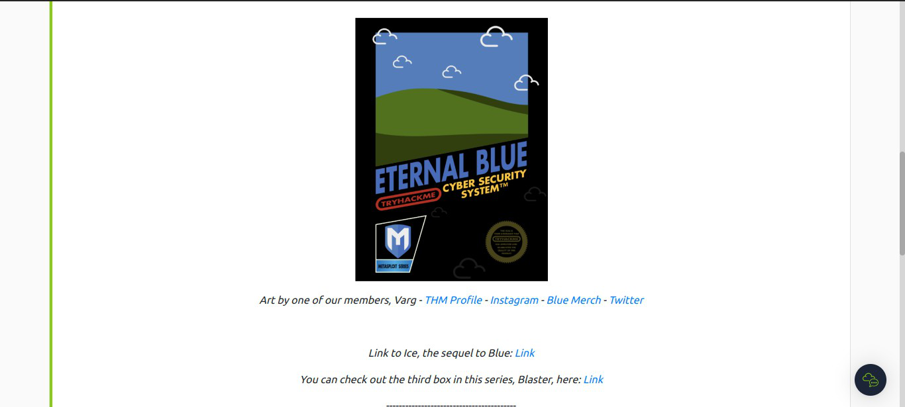
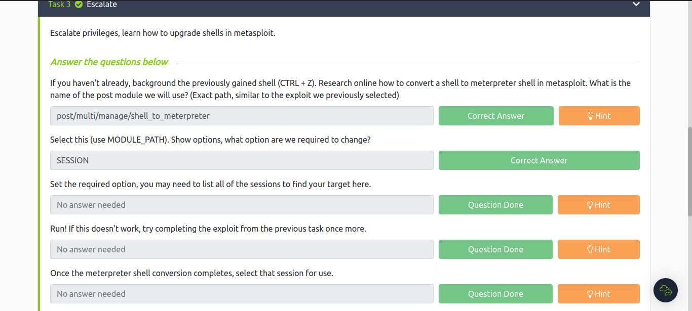
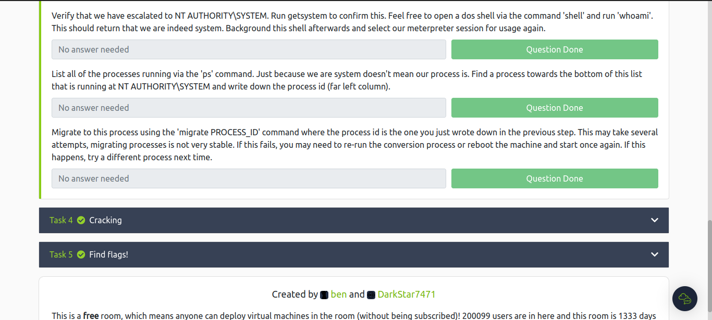
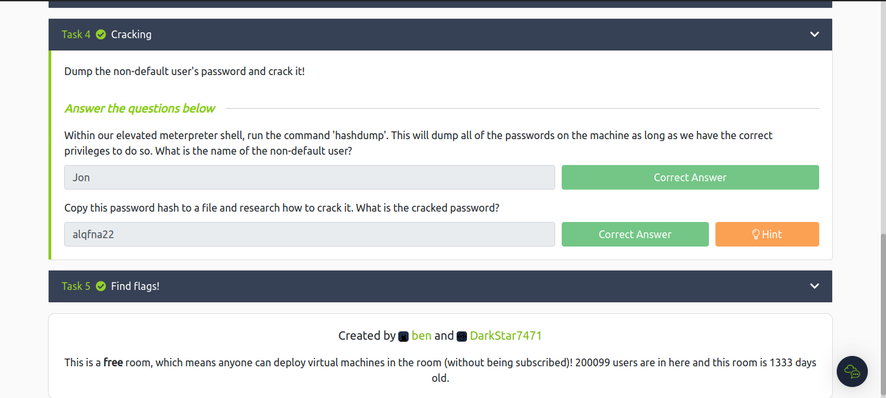
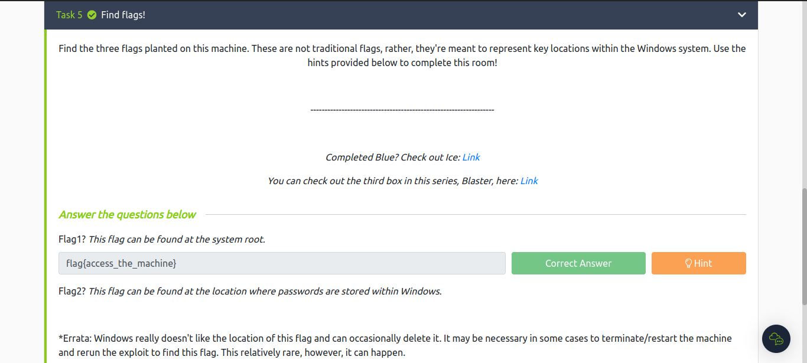
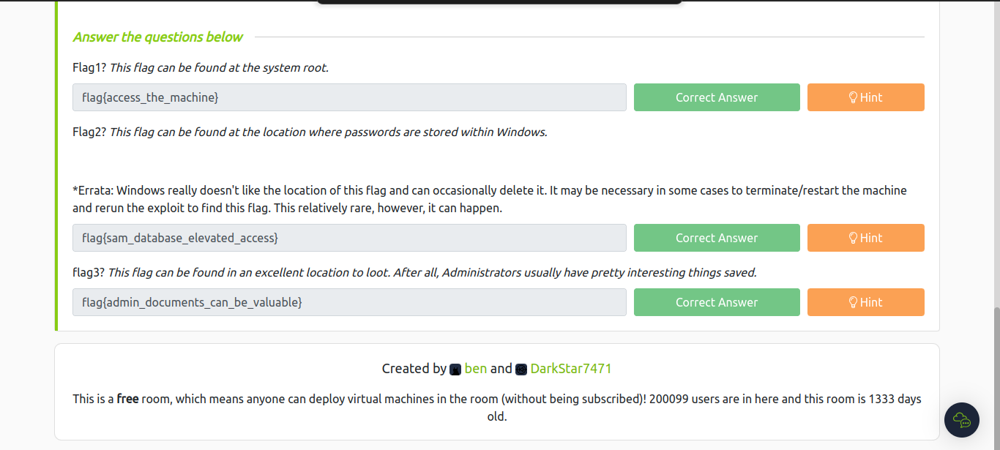

**[PROJECT-III]{.underline}**

> **Aim:**
>
>   To comprehensively understand and mitigate the risks associated with
> the EternalBlue exploit by exploring the **Blue** room on TryHackMe,
> ultimately strengthening Knowledge and skills in ethical hacking and
> vulnerablity assessment.
>
> **==\>Tryhackme User-Name:T.AyshAkhAn**
>
> **About the vulnerability:**\
> So, as the name of the room,gives us a small hint about the
> vulnerability or the exploit that can be used for the machine.
>
> Eternal Blue was the exploit used by the world famous WannaCry in
> order attack Windows bases systems using SMB(Server Message Block).
>
> *Fun Fact*: The NSA(National Security Agency) knew about this
> vulnerability and kept it as secret for more than five years from
> Microsoft.
>
> Metasploit has a module for this exploit.Its RCE(Remote Code
> Execution) where a program on the target machine allows execution of a
> malicious code remotely ,hence compromising the machine.

**Screenshots of the Room**

{width="6.9902766841644794in"
height="3.1458333333333335in"}

**TASK-1 : Recon**\
First we will start with the nmap scan.

> {width="6.990277777777778in"
> height="3.1458333333333335in"}

**TASK-2 : Gain Access**

> {width="6.9902766841644794in"
> height="3.147222222222222in"}
>
> **TASK-3:Escalate**

{width="6.988888888888889in"
height="3.147221128608924in"}

{width="6.9902766841644794in"
height="3.147222222222222in"}

> **TASK-4 :Cracking**

{width="6.988888888888889in"
height="3.1458333333333335in"}

> **TASK-5:Findflags!**

{width="6.9902766841644794in"
height="3.1458333333333335in"}

{width="6.988888888888889in"
height="3.147222222222222in"}

**THANK YOU**
